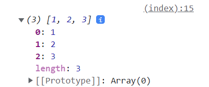
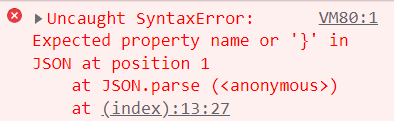

# Passing data from Django to javascript

## Passing json string

### code

``` python
## views.py
import json
from django.shortcuts import render

def index(request):
    data = {
        'sample1': [1, 2, 3],
        'sample2': [3, 6, 9],
    } 
    return render(request, "index.html", {'data_json': json.dumps(data)})
```

``` html
<!-- index.html -->
<html>
  <script>
  const data = JSON.parse('{{ data_json|safe }}');
  
  console.log(data.sample1);  // [1, 2, 3]
  </script>
</html>
```

### template filter "safe"

Marks a string as not requiring further HTML escaping prior to output. When autoescaping is off, this filter has no effect.

### In the above example...

- using "safe" filter:



- without "safe" filter:



ref: https://teratail.com/questions/299286

## Returning json response

### 

``` python
import json
from django.http.response import JsonResponse


def data_json(request):
    data = {
        'sample1': [1, 2, 3],
        'sample2': [3, 6, 9],
    } 
    return JsonResponse(data)
```

``` html
<html>
  <script>
  fetch("/data")
    .then(response => response.json())
    .then(data => {
      console.log(data.sample1)  // [1, 2, 3]
    })
  </script>
</html>
```

## Note on returning multiple values

To return more than 1 jason values as a list, the list must be wrapped like...

``` python
data = {"context": [list of json values...]}
```

# Ajax with Django

ref: https://blog.narito.ninja/detail/88
